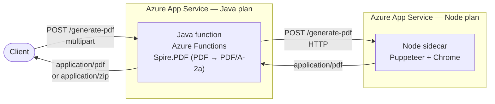
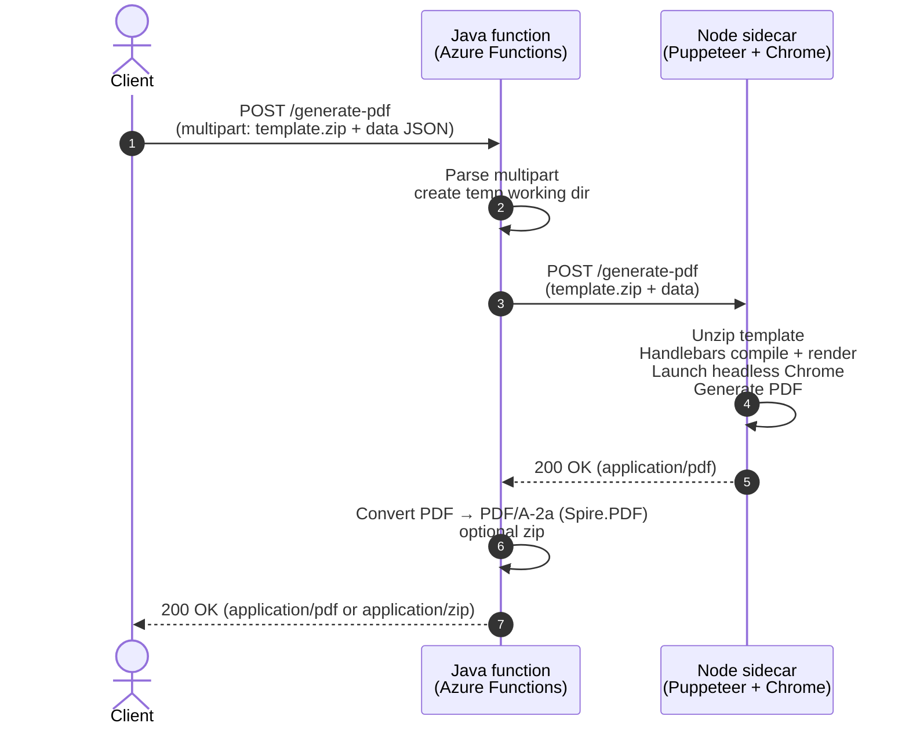

# pagoPA PDF Engine

[](https://sonarcloud.io/dashboard?id=pagopa_pagopa-pdf-engine)

Service that exposes a REST API to generate a **PDF/A-2a** document starting from a JSON payload and a Handlebars HTML template.

The project is composed of two processes:

| Component | Path | Runtime | Role |
|---|---|---|---|
| **Java function** (Azure Functions HTTP trigger) | `src/` | Java 17 | Public REST entry point. Receives the multipart request, forwards it to the Node sidecar, then converts the returned PDF to **PDF/A-2a** with Spire.PDF and (optionally) zips the result. |
| **Node.js sidecar** | `node/` | Node.js ≥ 24 | Renders the Handlebars template (with i18n support), launches a headless Chromium via Puppeteer and produces a plain PDF. |


### Deployment topology

Two components are deployed on **two distinct Azure App Service plans**, scaled independently.



### Request flow



---

## Summary 📖

- [API Documentation](#api-documentation-)
- [Technology Stack](#technology-stack)
- [Architecture & request flow](#architecture--request-flow)
- [Chrome version pinning](#chrome-version-pinning-)
- [Configuration](#configuration)
- [Run locally](#run-locally-)
  * [With Docker (recommended)](#with-docker-recommended)
  * [Java function with Maven](#java-function-with-maven)
  * [Node sidecar standalone](#node-sidecar-standalone)
- [Testing 🧪](#testing-)
- [Contributors 👥](#contributors-)

---

## API Documentation 📖

OpenAPI 3 specs:

- Public API (Java function): [`openapi/openapi.json`](./openapi/openapi.json)
- Internal Node sidecar: [`openapi/openapi_node.json`](./openapi/openapi_node.json)
- Monitor / info endpoints: [`openapi/openapi-pdf-engine-monitor.json`](./openapi/openapi-pdf-engine-monitor.json), [`openapi/openapi-node-monitor.json`](./openapi/openapi-node-monitor.json)

Quick view: [OpenApi 3 here.](https://editor.swagger.io/?url=https://raw.githubusercontent.com/pagopa/pagopa-pdf-engine/main/openapi/openapi.json)

---

## Technology Stack

**Java function**
- Java 17
- Azure Functions Java library 1.4.2
- Apache HttpClient 4.5 (to call the Node sidecar)
- Spire.PDF Free 9.13 — PDF → PDF/A-2a conversion
- Zip4j 2.11
- Logback + ECS encoder, Application Insights 3.7

**Node.js sidecar**
- Node.js ≥ 24
- Express 4 + Multer (multipart)
- Handlebars 4.7 + `handlebars-i18n` + `i18next` (multilingual templates)
- Puppeteer **25.0.4** with **Chrome 127.0.6533.88** (see [Chrome version pinning](#chrome-version-pinning-))
- `adm-zip`, `fs-extra`, `bwip-js`, `qrcode-svg`
- `applicationinsights` SDK

---

## Architecture & request flow

1. The client `POST`s a multipart request to `/generate-pdf` on the **Java function**.
2. The Java function parses the body, creates a temp working directory and forwards the JSON `data` + the `template` zip to the **Node sidecar** via HTTP `POST`.
3. The Node sidecar:
   - extracts the zip into a temp directory;
   - reads `template.html`, compiles it with Handlebars (an LRU cache keyed on the SHA-1 of the source avoids recompiling the same template on every request — `TEMPLATE_CACHE_MAX = 32`);
   - renders the HTML, opens it in a Chromium page via a `file:` URL;
   - waits for layout stability (`waitForRender` polls `body.scrollHeight` + DOM size until stable);
   - calls `page.pdf(...)` and returns the binary PDF.
4. The Java function converts the received PDF into **PDF/A-2a**.
5. If `generateZipped=true` the result is zipped, otherwise the raw PDF is returned with `Content-Type: application/pdf`.

> ⚠️ The HTML template inside the zip **must** be named `template.html` (the Node sidecar reads exactly that file).

---

## Chrome version pinning 📌

The Node sidecar **does not** use the Chrome version that `puppeteer install` would download automatically. Instead, [`node/Dockerfile`](./node/Dockerfile) explicitly installs **Chrome 127.0.6533.88** and tells Puppeteer to use it via `PUPPETEER_EXECUTABLE_PATH`.

### Why

During the multilingual rollout we upgraded Puppeteer from `22.x` to `24.x` / `25.x`. With the newer Puppeteer, `yarn install` started bringing in much more recent Chrome (Chrome for Testing) builds, and PDF generation throughput dropped from **~4.94 req/s** (baseline `2.10.23`) to **~3.72 req/s** under our standard k6 load test, even after isolating every other variable (Node version, code changes, template, infra).

Bisecting Puppeteer + Chrome combinations against the baseline showed the regression lives in the bundled **Chromium PDF pipeline** (`Page.printToPDF` / layout under load), not in Puppeteer's JS layer. Forcing Puppeteer 25 to drive **Chrome 127** (the last build bundled with Puppeteer 22.x) restored the baseline (**~5.00 req/s**) without rolling back any other change.

Puppeteer 25 talks to Chrome via the DevTools Protocol, which is backward compatible for the commands we use (`Page.navigate`, `Page.printToPDF`, …), so pairing it with an older Chrome is fully supported.

### How

In [`node/Dockerfile`](./node/Dockerfile):

```dockerfile
# 1) Skip Puppeteer's automatic Chrome download at install time
ENV PUPPETEER_SKIP_DOWNLOAD=true
ARG PINNED_CHROME_VERSION=127.0.6533.88

# 2) Install the pinned Chrome explicitly into PUPPETEER_CACHE_DIR
RUN npx --yes @puppeteer/browsers install chrome@${PINNED_CHROME_VERSION} \
        --path ${PUPPETEER_CACHE_DIR}

# 3) At runtime, point Puppeteer to that exact binary
ENV PUPPETEER_EXECUTABLE_PATH=/usr/src/app/.cache/puppeteer/chrome/linux-${PINNED_CHROME_VERSION}/chrome-linux64/chrome
```

### Maintenance

- To try a different Chrome build, override the build arg:
  `docker build --build-arg PINNED_CHROME_VERSION=128.0.6613.137 -t pdf-engine-node ./node`
- Available builds: <https://googlechromelabs.github.io/chrome-for-testing/>
- The pin should be re-evaluated every 3–6 months: if a newer Chrome stops exhibiting the PDF regression, remove the pin and let Puppeteer manage the browser.
- If you bump Puppeteer, also bump the headless-shell native dependencies (`apt-get install` list in the Dockerfile) to whatever Puppeteer's troubleshooting docs require.

---

## Configuration

### Java function

| Variable | Default | Description |
|---|---|---|
| `PDF_ENGINE_NODE_GENERATE_ENDPOINT` | `http://localhost:3000/generate-pdf` | URL of the Node sidecar `generate-pdf` endpoint |
| `PDF_ENGINE_NODE_INFO_ENDPOINT` | `http://localhost:3000/info` | URL of the Node sidecar `info` endpoint |
| `PDF_ENGINE_NODE_SUBKEY` | `NO_SUB_KEY` | Value of the `Ocp-Apim-Subscription-Key` header sent to the sidecar |
| `WORKING_DIRECTORY_PATH` | `""` (current dir) | Base directory for per-request temp folders |
| `APPLICATIONINSIGHTS_CONNECTION_STRING` | — | App Insights connection string for telemetry |

### Node sidecar

| Variable | Default | Description |
|---|---|---|
| `PUPPETEER_EXECUTABLE_PATH` | set by the Dockerfile to the pinned Chrome | Override the Chrome binary used by Puppeteer |
| `PUPPETEER_CACHE_DIR` | `/usr/src/app/.cache/puppeteer` | Where Puppeteer looks for installed browsers |
| `PUPPETEER_SKIP_DOWNLOAD` | `true` in the image | Skip automatic Chrome download during `yarn install` |
| `CHECK_SIZE_INTERVAL` | `100` (ms) | Polling interval used by `waitForRender` |
| `MIN_STABLE_SIZE_ITERATIONS` | `3` | Number of stable polls before the page is considered fully rendered |
| `PERF_LOG` | `false` | When set to `1`/`true`/`yes`, emit fine-grained per-phase timings as App Insights `PDF_ENGINE_NODE` custom events with `properties.type = "PDF_ENGINE_NODE_PERF"`. Disabled by default to avoid telemetry noise/cost in production. |
| `APPLICATIONINSIGHTS_CONNECTION_STRING` | — | App Insights connection string for telemetry |

### Template zip layout

The `template` form field must be a zip containing **at least**:

```
template.html        # main Handlebars template (mandatory)
style.css            # CSS file referenced from template.html (optional, but recommended to avoid inline styles)
assets/*             # optional assets referenced from template.html
```

---

## Run locally 🚀

### With Docker (recommended)

Builds a single image containing both the Java function and the Node sidecar (started by `start.sh`):

```bash
docker build -t pagopa-pdf-engine .
docker run -p 7071:80 pagopa-pdf-engine
```

Sample call:

```bash
curl --location 'http://localhost:7071/generate-pdf' \
  --header 'Ocp-Apim-Subscription-Key;' \
  --form 'template=@"template.zip"' \
  --form 'data="{
        \"transaction\": {
            \"id\": \"F57E2F8E-25FF-4183-AB7B-4A5EC1A96644\",
            \"timestamp\": \"2020-07-10 15:00:00.000\",
            \"amount\": 300.00,
            \"psp\": { \"name\": \"Nexi\", \"fee\": { \"amount\": 2.00 } },
            \"rrn\": \"1234567890\",
            \"paymentMethod\": {
                \"name\": \"Visa *1234\",
                \"accountHolder\": \"Marzia Roccaraso\",
                \"extraFee\": false
            },
            \"authCode\": \"9999999999\"
        },
        \"user\": {
            \"data\": {
                \"firstName\": \"Marzia\",
                \"lastName\": \"Roccaraso\",
                \"taxCode\": \"RCCMRZ88A52C409A\"
            },
            \"email\": \"email@test.it\"
        },
        \"cart\": {
            \"items\": [{
                \"refNumber\": { \"type\": \"codiceAvviso\", \"value\": \"123456789012345678\" },
                \"debtor\": { \"fullName\": \"Giuseppe Bianchi\", \"taxCode\": \"BNCGSP70A12F205X\" },
                \"payee\": { \"name\": \"Comune di Controguerra\", \"taxCode\": \"82001760675\" },
                \"subject\": \"TARI 2022\",
                \"amount\": 150.00
            }],
            \"amountPartial\": 300.00
        },
        \"noticeCode\": \"noticeCodeTest\",
        \"amount\": 100
    }"' \
  --form 'applySignature="false"' \
  --form 'generateZipped="false"' \
  --output receipt.pdf
```

### Java function with Maven

Prerequisites: `git`, `maven`, JDK 17. The Node sidecar must be reachable on `PDF_ENGINE_NODE_GENERATE_ENDPOINT` (default `http://localhost:3000`).

```bash
mvn clean package
mvn azure-functions:run
```

### Node sidecar standalone

Prerequisites: Node.js ≥ 24, Yarn 1.x and a Chrome binary (either set `PUPPETEER_EXECUTABLE_PATH` to a local Chrome, or unset `PUPPETEER_SKIP_DOWNLOAD` so Puppeteer downloads its bundled one — note this won't be the pinned Chrome 127).

```bash
cd node
yarn install
# Optional: point to a local Chrome binary
# export PUPPETEER_EXECUTABLE_PATH=/path/to/chrome
yarn start          # listens on port 3000
```

---

## Testing 🧪

### Unit tests

Java:

```bash
mvn clean verify
```

Node:

```bash
cd node
yarn install
yarn test            # or: yarn test:coverage
```

### Integration tests

```bash
cd integration-test/src
yarn install
yarn test
```

### Performance tests

k6 scenarios live under [`performance-test/`](./performance-test/). The reference scenario is `constant-arrival-rate` at 50 req/s for 3 minutes (`performance-test/src/test-types/constant.json`).

```bash
cd performance-test
./run_performance_test.sh
```

Per-phase timings emitted by the Node sidecar (`PERF_LOG=true`) are available in Application Insights as custom events named `PDF_ENGINE_NODE` with `properties.type = "PDF_ENGINE_NODE_PERF"`.

---

## Contributors 👥
Made with ❤️ by PagoPa S.p.A.

### Maintainers
See `CODEOWNERS` file.
